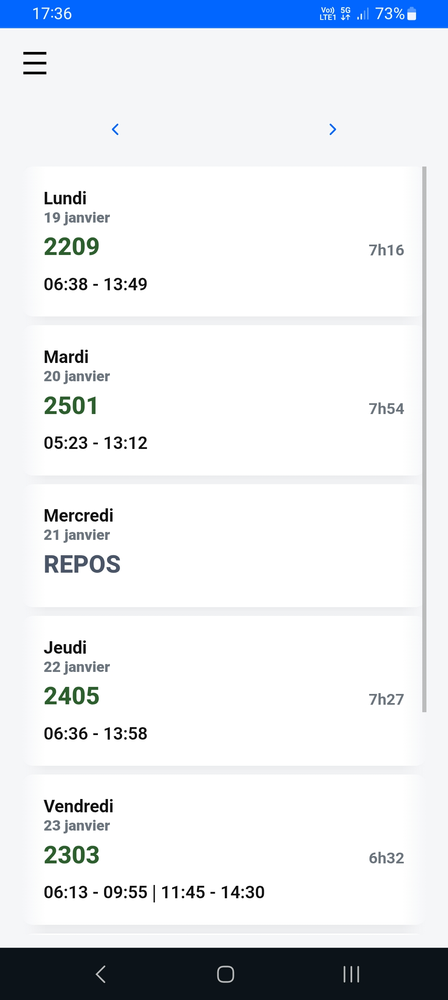
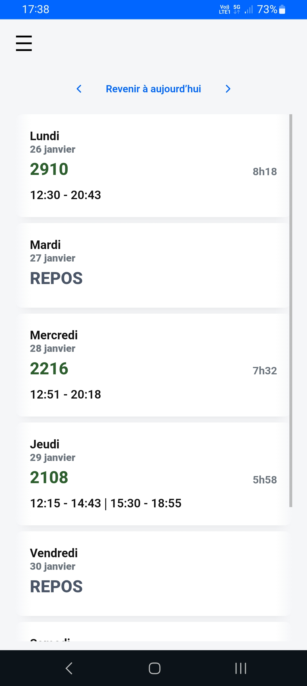
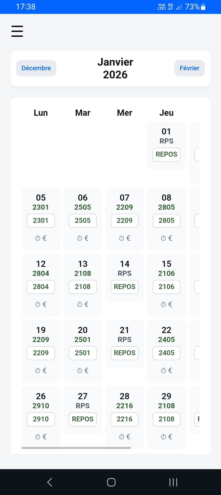
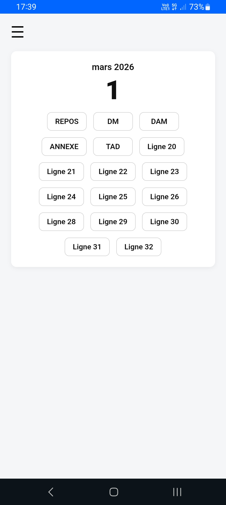

<!-- refresh github -->

# Planning PWA

Application web progressive de gestion de planning.  
Projet personnel développé en JavaScript vanilla.

© 2026 – Tous droits réservés.

---

## Prototype métier offline-first

Application PWA conçue par un chauffeur pour résoudre un problème réel de consultation et de saisie de planning quotidien, en conditions de terrain (smartphone, réseau instable, rapidité).

Fonctionne 100% offline, sans serveur, sans authentification, avec stockage local des données.

---

## Lancer le projet en local

Cloner le dépôt :

git clone <repo>
cd planning_v2

Lancer un serveur local :

python -m http.server

Ouvrir ensuite dans le navigateur :  
http://localhost:8000

---

## Objectif métier

Permettre à un chauffeur de bus de :

- Consulter son planning instantanément
- Naviguer jour / mois rapidement
- Saisir son planning facilement
- Disposer d’un outil personnel, fiable, toujours disponible

Voir : CONTEXTE_METIER.md

---

## Architecture technique

- HTML / CSS / JavaScript vanilla
- Router maison par masquage DOM
- IndexedDB + LocalStorage
- Service Worker avec cache versionné
- Hébergement GitHub Pages
- Aucune dépendance externe

Voir : ARCHITECTURE.md

---

## Gestion du offline et des mises à jour

Le Service Worker implémente un versionning explicite du cache pour éviter le problème classique des utilisateurs bloqués sur une ancienne version.

Voir : SERVICE_WORKER.md

---

---

## Aperçu de l’application

### Accueil

### Vue jour

### Vue mois

### Saisie guidée

